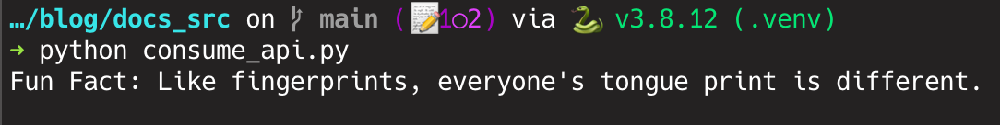

# 👽️ How to consume an API with Python

To consume an API in a simple way with python we will use the library called [requests](https://docs.python-requests.org/en/latest/).

## 🔧 Preparing the Environment


=== "Virtual Env"

    ```bash

    python3 -m venv .venv # (1)
    source .venv/bin/activate # (2)
    pip install requests # (3)

    ```

    1. Creating a virtualenv (:warning: Change `python3` to your python PATH if necessary)
    2. Activate the virtualenv (MacOS and Linux)
    3. Install [requests](https://docs.python-requests.org/en/latest/user/install/#installation-of-requests)

=== "Poetry"

    ```bash

    poetry install requests # (1)

    ```

    1. Install [requests](https://docs.python-requests.org/en/latest/user/install/#installation-of-requests) with [Poetry](https://python-poetry.org/)


## ⌨️ Code

  In this example we are going to consume an [API](https://api.aakhilv.me) that will return random fun facts and print it on screen. 


```python linenums="1" title="consume_api.py"
--8<-- "consume_api.py"
```

1. Importing the requests library
2. Performing the get on endpoint `/fun/facts` in the API
3. Checking if the request returned any error [status_code](https://developer.mozilla.org/en-US/docs/Web/HTTP/Status), in case of error it will generate an exception of type `HTTPError` (Line **9** handle this)
4. Convert response to json and get first element from the return list
5. Print on screen the random fun fact
6. If line **6** raise an `HTTPError` exception, here it will be handled
7. Print status_code information and the error


## 🚀 Running the Application

  ```bash
  python consume_api.py
  ```

## 🖼️ Output

